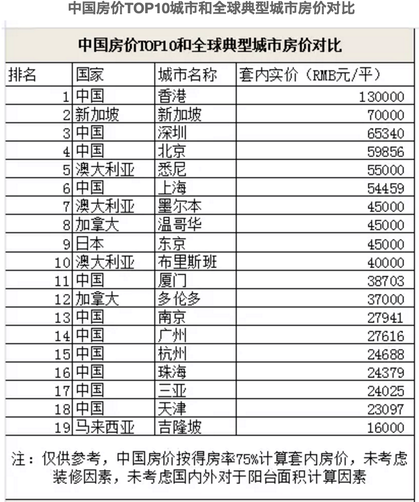
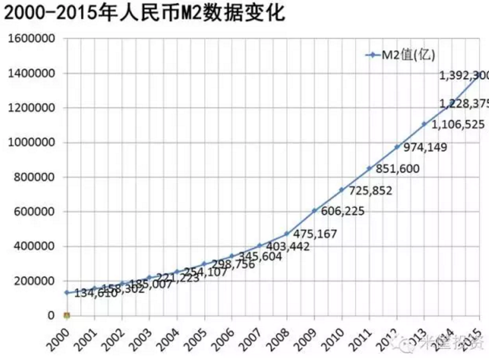
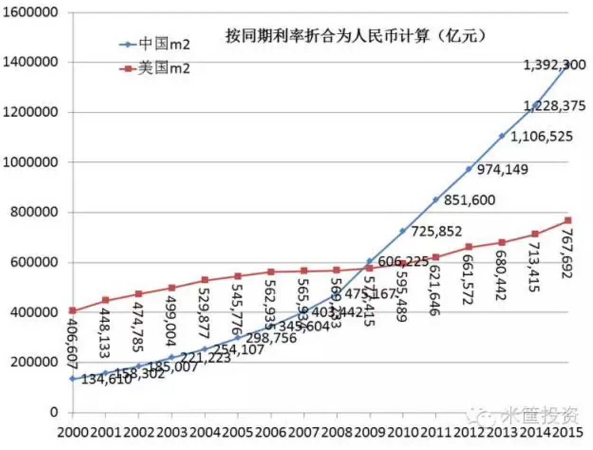
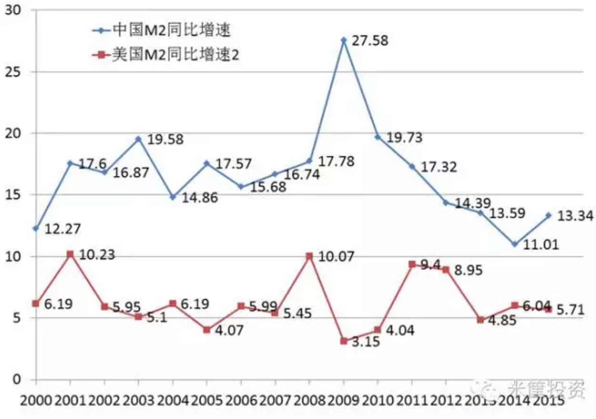
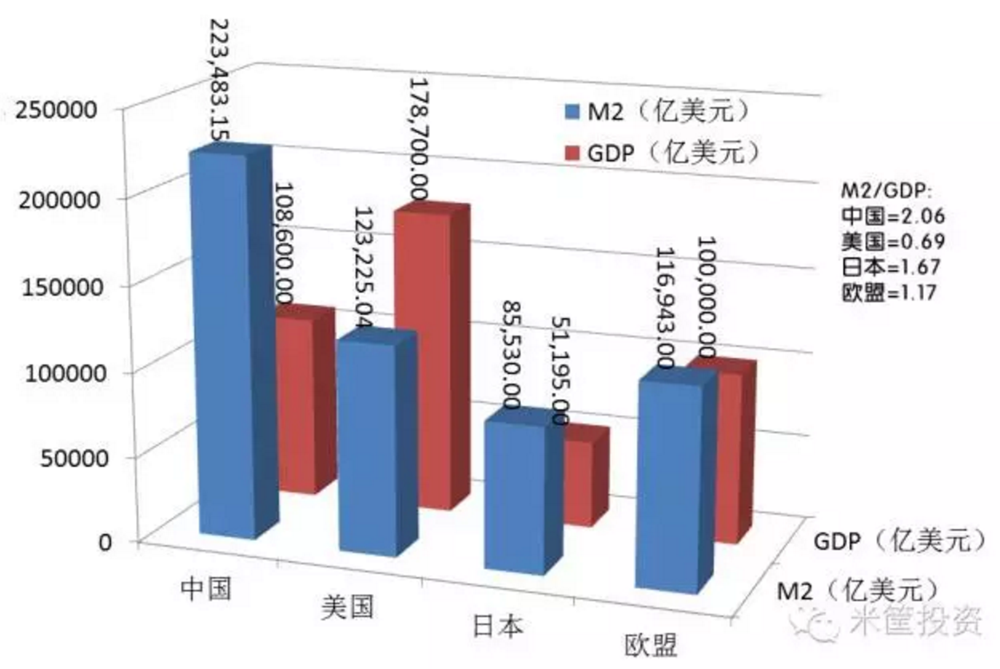
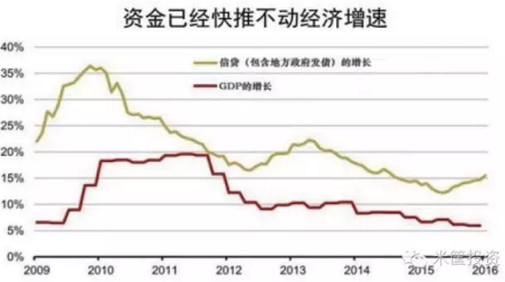
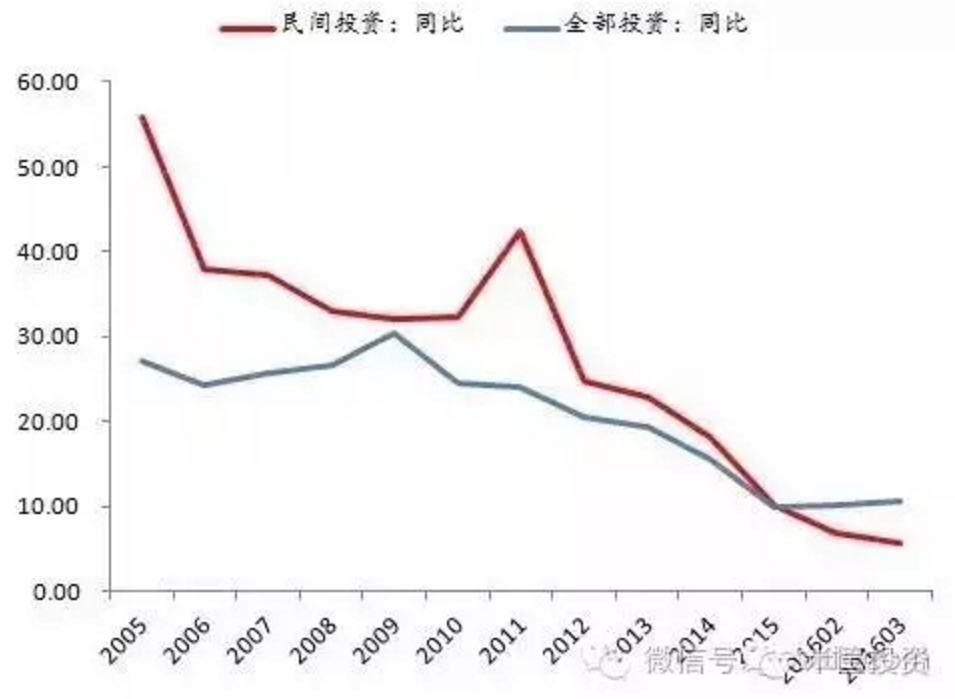

## 面对泡沫，政府是保房价还是保汇率？

> 原文地址：[面对泡沫，政府是保房价还是保汇率？(新财富杂志)](https://mp.weixin.qq.com/s?__biz=MjM5MDAyNzQ0MA==&mid=2651037503&idx=4&sn=c99cfaff99ef97413493d7506503d9db&scene=0&pass_ticket=mB%2BuDOEkdqk99jt5R%2FXTVdntEeG%2FA%2B4S2CF8KtQJaow%3D#rd)   __

写在前头：

> 不谈大事，能够把自己的事情管好，不给国家增加负担，就是天大的事了，先管好自身的事情，理解大事只是为了让自己安心，降低焦虑，同时，确定未来几年的努力目标和方向。
> 
> 正值青年，赶上大繁荣，这几年是会被写入教科书的，亲身经历了股市、楼市的大发展，特别是楼市；自己没有房产，看着身边同学一个个都买了房，而且京沪房价半年上涨50%，搞得自己略有焦虑；在这种情况下，我希望增加对楼市的理解，心里有个底，涨也好、降也罢，心里有个底，减少无端的焦虑。

**个人结论：不说了，没有什么保汇率、保房价之说；人民币被高估是事实，对美元一次性大幅贬值的预期很强，国内通胀的预期也很强，购买固定资产进行对冲的预期也很明显，而且自己并没有自己的房产，因此，我个人需要努力工作，尽快在核心城市的成熟地段，尽快购入自己的房产，借用一句：有恒产者，有恒心，我将努力有恒产。**

疑问：

* 什么是保汇率？
* 什么是保房价？

下面这个逻辑有没有问题：

1. 保汇率，就是保持人民币对美元的汇率基本不变；
	1. 为什么要保汇率？因为国内需要的大宗粮食（大豆、玉米）都是用外汇购买的，只有汇率基本稳定，才能避免外汇流失；
	2. 如果人民币贬值预期增大、外汇大量减少，基本生活资料价格会飙升，潜在社会动荡；
	3. 现在国内流通的人民币很多，相对美元，人民币就有贬值的压力，因此，要减少流通的人民币；
3. 减少流通的人民币，备用的措施有很多：
	1. 把流通的人民币引入到固定资产中，锁定起来；
	2. 减少贷款发放；
	3. 提高存准；
	4. 增加人民币存款利息等；
4. 减少流通的人民币，需要把握一个度，否则产生潜在后果：
	1. 如果人民币减少过多，产生通缩预期，经济失去活力，因为一切生产活动都要依赖货币的流动；
	2. 人民币流通量减少，会影响政府财政收入，导致既定的预算案无法继续执行；
	3. 适度的通胀预期，会刺激消费，因为大家潜意识里觉得钱越来越不值钱，尽快消费掉才划算；
	4. 市场上流通的人民币减少，产生通缩预期，大家会珍惜手中的人民币，这样大额资产（比如房价）的交易量就会减少，供过于求，资产价格会适当降低；
5. 保汇率：当前情况下，就是要适当减少人民币流通量，既保证汇率稳定，又要避免产生通缩预期，力争适度通胀。

# 原文内容如下：

> 知识补充：为什么说保房价和保汇率“两难”？如果房价继续上涨，资本将加速流向海外，中国外汇储备会被快速耗尽，届时人民币将大幅贬值并带来输入性通胀。如果要稳定汇率，则需要大幅降低房地产等国内资产价格以留住资本。
> 
> 明白了这个，看全文干货↓↓↓

显然，因错失太多机会，中国经济已经步入到了一个骑虎难下的困难境地，繁华背后是风声鹤唳，摆在政府面前的三个最大问题就是：

1. 资产价格过高
2. 人民币估值过高
3. 债务负担过重

每一个问题爆发，都能引发系统性的危机！都是政府不愿意看到的！也是百姓不愿意面对的！

政府会怎么做？我们该怎么办？

## 三大泡沫之资产泡沫

20多年以来，中国经济模式一直都是以政府主导投资驱动为引擎的经济模式，在以投资、出口、消费三架马车的模型中，如今能主要关注的只有投资了，谈投资，主要的也就只有房地产经济了，所以，当下在中国谈资产价格，主要就是指房价。

中国房价TOP10城市和全球典型城市房价对比

对于中国房价的泡沫问题，已经根本不需要去争论，这已经是危害到了国计民生的问题，已经是全球公认的问题。

如果政府要去除资产泡沫，会发生什么负能量的事情？

>1、去资产泡沫，直接说就是要降房价
>
>2、降房价，则触动的是地方政府、开发商、购房者、银行四方的核心利益
>
>3、房价降20%，首付20%的购房者则可能抛弃已购房产
>
>4、房价降，土地价格就要降，地方政府的贷款、融资平台、地方债务怎么办？
>
>5、房价降，对于买涨不买跌的中国大众来说，房地产市场会立即降温，开发商欠银行的钱怎么办？
>
>6、房价跌，势必会引发债务产业链上的大面积债务违约，购房者不还贷、开发商还不上钱、地方政府卖不了地还不了钱，最终，银行坏账大面积产生。
>
>7、中国特色的维权开始，购房者堵售楼部要求退房，处理不好就是群体事件。
>
>8、这个问题，动摇的可就是国家稳定的根基。

如果政府要去除资产泡沫，会发生什么正能量的事情？

>
>1、楼市降温，钱去哪里？会不会倒逼入实体经济？(思考：一定回去吗？)
>
>2、如果政府能给企业家信心，一个中长期的信心，在中长周期内是坚决的去除资产泡沫，扶持实体经济的话，大量资金会转向实体经济。
>
>3、只有民营经济的心转向了实体经济、只有钱流向了实体经济，中国的经济才有未来和希望，才能彻底解决当下的大多数经济问题。
>
>4、理论上，这是最好的处理危机的方式。当然，阵痛是必须要有的，而且很痛，要为以前的不理性付出代价，这也是日本模式。地产经济不死，实体经济必然难活，因为在现在的中国，地产就是金融，金融就是地产，这个现状不改变，金融就起不到为实体经济服务的作用。

思考：钱离开资产，就一定会进入实体经济？实际上，资本逐利，只要实体经济的收益大于房产增值预期，钱自然会涌入实体经济，一心一意搞建设。

如果继续保资产，让资产泡沫继续，会发生什么？

>
>1、对中国实体经济是致命摧毁，中国仅有的一点实体经济也会被摧毁。
>
>2、对民众信心的严重伤害，虽然房价高涨不跌，但百姓也不是傻子，自然知道不合理，全国恐慌情绪会蔓延。
>
>3、中国经济结构性调整的周期继续后延，中国经济进一步下滑。
>
>4、像董潘所说，未来北京房价80万/平，这也是有可能的。

思考：当前中国，一二线城市及周边房价高居不下，三线、四线、五线的地级市、县城房价并不是天价，大部分人都能付的起，但是，三线、四线、五线的城市，工作机会少，法制环境差，人均收入低。而大部分优秀的人才，都聚集在一线、二线城市以及周边，即使这部分人在三～五线买房产，也不会实际居住，造成空置。但是，三～五线，房子已经盖好了，而且开发商、银行、地方政府背负巨大的负债，这些房子怎么办呀？

## 三大泡沫之人民币泡沫

什么是M2、GDP、通货膨胀、CPI？

> * M0就是社会上的现金，
> * M1就是M0+企业的活期存款，
> * M2就是M1+全国的定期存款。

> 如果把国家比作一个超市，M2的增长也就是货币总量的增长，GDP的增长可以简单看作是整个超市内货物数量增长。货物的增长速度跟不上钱的增长速度，货少钱多，货就会涨价。货涨价的幅度就是CPI的涨幅。
> 
> m2 = GDP + CPI

M2是最能体现信贷情况、判断经济基本面的一个数据。

中国15年以来的M2变化：

思考：从哪儿查询，中国 m2 的增长情况？国家统计局？

中国的M2数据在过去15年膨胀了10倍！(中国速度就是这么快，翻天覆地的变化是实实在在的，我能感受的到)

中国与美国M2变化：

可以看出，美国M2数据在过去十多年是平稳上升，没有剧烈变化，但中国的M2自2008年开始加速上升，在2009年超过美国，并继续保持高昂的姿态在上升，截止2015年底，中国的M2数值已经是美国的1.813倍！

中国与美国M2同比增速比较：

如图，我们的M2扩张数据在过去10多年间，一直远超美国！

中国与世界四大经济体的M2与GDP数据比较：

可以看出，目前中国的货币可以出去买下整个美国和多半个欧盟，到2016年底，我们就可以买下整个美国和整个欧盟了，可笑不？

中国目前的M2增速是13%左右，全球M2增速是7%左右，照此速度不变、人民币不贬值的话，不出10年，理论上中国可以买下全世界！

所以，人民币贬值，已经是全球公认的事实，只是贬值速度、何时贬值的问题。

思考：确实是，中国 m2 差不多买下整个美国和半个欧盟，人民币是被高估了，确实应该贬值，但是贬值是谁说的算？什么时候贬值？贬值的收益是什么？风险又是什么？

如果人民币直接大幅贬值，会发生什么负能量的事情？

>
>1、国内的资金恐慌，争相跑出中国寻求安全的庇护所，中国外汇储备必将很快耗干，人民币贬值就变得不可遏制。
>
>2、如果中国强行管制，违背的就是全球经济公约和一系列合作协议要求，人民币国际化的步伐直接停止，国际指责如何应对？
>
>3、主权债务问题也会发生，主权评级也会下调，对中国在国际形象影响较大。
>
>4、人民币贬值后，我们大量对外依存的进口商品（如大豆、石油、矿石、农产品、精密仪器、药品 等）将成本大大提升，势必加重国内人民负担，提高国内生活成本，造成输入性的通货膨胀！
>
>5、人民币贬值，出国旅游、海外投资就降温了，影响的是企业或有钱人。
>
>6、人民币贬值，外汇出逃时，通常政府都会加息来对冲，反过来，加息会加重危机中的国内经济，加重企业负担和债务负担，处理不当，也会引发连锁危机。

思考：10月1日，人民币已经被纳入 SDR，中国政府强制贬值，会导致人民币的信誉损失（政府信誉），而且，如果不能一次性贬值到位，会引发外汇流失，动摇中国大宗商品的进口；贬值之后，外资再次涌入，还会引发外源性导入性通胀，这些情况都需要提前考虑。

如果人民币直接大幅贬值，会发生什么正能量的事情？

>
>1、人民币贬值影响最多的是有钱人，是老板，是外企，是外资，是热钱，这些人毕竟是少数。
>
>2、基本上，老百姓不会闹事，因为，对于没有大多数没有存款的老百姓来说，只要房价不跌，抱着房子睡觉最安心，那怕人民币贬值80%呢，和百姓没啥关系。
>
>3、对出口企业利好，可以改变近几年出口贸易一直不振的现状。
>
>4、对国家和政府最好的是，基本上不会有群体事件发生。

思考：当前看来，一次性大幅贬值，对国家、人民最有利，因为虽然会损失一部分外汇，但是，由于中国的出口成本大幅降低（中国当前已经具备良好的各种外贸产品的生产线和技术人员），因此，外贸出口会赚回更多的外汇。

如果保人民币，不贬值，会发生什么？

>
>1、在全球公认的估值过高之下，大多数的钱会选择趁高位离开中国，要不出去购买资产，要不出去寻求安全。
>
>2、在钱逐步离开中国之时，外汇耗干之时，人民币不想贬值也要贬值。
>
>3、目前人民币民以每月400-500亿的速度外流，不出意外，2018年中，外汇储备就会耗干。都没外汇储备了，还说不贬值？打脸吗？
>
>4、亲，也许你们也只有两年的时间，两年后，想换外汇，也没有了。

思考：人民币明显被高估的情况下，有些资产会套现后离开，消耗巨量外汇，动摇中国大宗商品的进口，卧槽，怎么回事？人民币贬值或者不贬值，都会导致外汇流失？到底怎么情况？哪种流失的严重？哪种情况下，是净流失？

## 三大泡沫之债务泡沫

不容忽视的债务数据：

>
>1、中国企业债务已经占到了GDP的1.9倍
>
>2、地方政府债务已经占到了GDP的50%，达30多万亿
>
>3、法兴银行在一份研报中称，中国银行业不良资产贷款率达15%左右
>
>4、企业债务（包括国企）违约状况已经接连到来

如图，信贷在扩张，但增速在下降：

20年以来，我们一直得以生存的投资式经济发展模式，突然行不通了！突然走不动了！信贷在扩张，经济却没有增长，这是很可怕的事情，从去年的股灾、今年的房灾、以及中间发生的螺纹钢事件，以及未来可能发生的农产品动荡事件，都与此有关，因为，M2在扩张，钱太多，却无处可去，就流向可炒作的资源，所到之处，无不造成重大动荡和伤害。

深层次影响的就是整个中国企业界的投资信心：

我们看到，从2016年初开始，民间投资信心锐减，这是很可怕的事情，为什么不再投资？是对未来没有信心，或者说，是已经对政策没有信心，再严重一点，是对政府没有信心。

思考：现在民间投资信心降低，关键是实体经济预期收益太低，甚至是亏损，因为，当前全球经济不好，而政府为了保证财政收入，地方政府就采取了特殊措施，加税、收过头税，财政收入增长远远超过 GDP 增长，民间企业负担过重，预期收益过低，而，房产等固定资产的预期收益比较高而且稳定，因此，部分民间投资，从实体经济撤出，转而进入房地产。

这个情绪的蔓延，很可怕，最终导致的就是大面积的债务违约，就是经济危机。

一张100元的钞票，我相信你，这就是100块钱，我不再相信你时，这就是一张废纸。

债务泡沫根本上还是资产泡沫的延伸

>
>1、过去10年以来的房价上涨，就是一直靠债务扩张来维持的，房价涨、地价涨、信贷扩张、债务扩大。
>
>2、债务泡沫破裂会影响并刺破资产泡沫，资产泡沫破裂也会影响并刺破债务泡沫，两者是相互依存的骨肉兄弟。
>
>3、而债务大面积违约，最终会导致，经济危机，会形成群体事件，这是国家和政府不愿意看到的。

为什么房价和汇率不可兼得？

如果想保房价

>
>就是让所有人都认为房价还要上涨，于是购房者继续买、开发商继续拿地，不管是因为恐慌还是因为期待，反正就是认为房价还要涨。
>
>就只能靠继续信贷扩张、继续增加M2投放、给开发商和地方政府继续加杠杆、继续借新还旧维持房价上涨，钱越来越多，钱继续往房地产市场上涌，泡沫继续拱，大家争相购买，房价自然就降不下来，地价也是一路涨，资产价格一路升，如同你在2016年上半年看到的一样。
>
>在此情况之下，国内实体经济肯定是继续下滑，消费也是不振的，国内的钱会越来越多，M2余额越来越大，远超世界平均水平，越来越多的人对未来充满恐慌，人民币预期估值肯定就会再被下调，加重人民币贬值压力。

思考：因为人民币被高估，因此有巨大的贬值压力，如果要保证资产的价格（相对美元），就需要继续信用扩张（信用扩张就是印钱，让流通的钱增加），负债继续增加，保证政府财政收入，增加就业机会，一旦停止信用扩张，就业率下降，居民收入无法实现持续增长，银行房贷就有违约风险。

疑问：如果不再继续信用扩张，流通的钱不再明显增加（m2 增速降低），资产价格就会降低吗？因为没有明显的国内贬值预期，所以，钱不会涌入固定资产去避险。

如果想保汇率

>
>想保汇率，就要遏制资金外流，如何不让资金外流？就是让钱自己知道，出不出去差别不大，比如国内资产已经贬值了，钱出去还不如在中国呢，反正国内资产已经贬值这么低了，出去再回来也赚不到钱，还不如在国内呆着看那个企业顶不住资产贬值带来的压力要破产，抄底收购优质资产更重要，其实就是要增加钱呆在国内的预期，减小钱出去之后的预期。
>
>钱不再外流了，汇率自然也就保住了。

所以，保房价、保汇率是两条不一样的经济思路，不可兼得，不可同行。政府只能选择一条路去走。

思考：现在看起来，最好的办法，一次性对美元大幅贬值（国际上对美元贬值），然后，继续制造国内的适当通胀预期。

## 政府会怎么做？

政府会怎么做，也就是选择东京泡沫破裂模式还是莫斯科泡沫破裂模式的区别。

### 日本模式：刺破资产泡沫

日本房地产也是在1985-1990经历了疯狂的泡沫式增长，最终，日本选择的是去除资产泡沫的解决方式，日本房价下降50%，但日元和美元汇率变化不大，最终，也教育了整个日本，从此20多年，日本房价再也没有起来过，所有的企业都在乖乖的从事着以前的实体制造业。

当然，那次经济危机也给日本经济造成了重伤，房价下跌下的债务危机全面爆发，购房者跳楼、开发商破产、企业破产、银行破产。。。。那些在高位接盘的购房者不得不面对现实，用余生来偿还高额的房贷。

而，很多日本企业，又不得不出售很多的国外资产，回国救灾。

好的是，伤害了日本人民，也最终挽救了日本经济。

思考：不太理解，日本房价怎么下降的？政府的行政命令？日本经济房地产受这么大的损失，没有引发资本恐慌，从而导致外汇挤兑外逃么？这外资的信息也太强了？

### 莫斯科模式：保资产、弃汇率

缘于乌克兰事件，2014年，世界原油价格开始暴跌，从年初的100美元跌至年底的53美元，以美国为首的西方国家集团对俄罗斯实施了一系列经济制裁，并且不断加码，严重干扰了俄罗斯的金融形势乃至实体经济的发展，不仅中断了俄罗斯在西方的融资通道，而且还促使俄罗斯国内资本(包括外来投资和境内资本)大量外逃，外汇需求猛增，卢布遭遇集中抛售。

2014年上半年1美元还可以兑换35卢布，到12月中旬的时候不但腰斩过半，还曾下探1美元兑换80卢布的历史低位，贬值幅度超过50%。2014年12月15日卢布曾一夜暴跌13%，创近16年来最大单日跌幅。

为应对外汇锐减，数次加息后，基准利率从5.5%提高到17%，提高幅度高达惊人的209%。如此频繁地调整基准利率，并且提高幅度如此之大，利率绝对值如此之高，均为同期世界各经济体所罕见，也是俄罗斯本国自1998年金融危机以来的第一次。

货币贬值通常与通货膨胀伴随而行。据俄官方公布的数据，俄罗斯2015年1月通胀率达到15%，创7年新高。2015年俄罗斯食品价格涨幅达14.3%，通胀率达12.9%，在全球主要经济体中居第三位。

卢布贬值》加息》国内严重通胀，这是俄罗斯经济危机的发展轨迹，而在莫斯科，以卢布计价的房价，没有跌。

思考：外汇大量外流，货币贬值，此时，外汇不足，就需要以更多的本国货币兑换外币，此时，势必需要印制更多货币，引发通胀。

### 中国会怎么选择？

1、国家稳定是最大的根本，所以，从理性上分析，因为80%以上的人除了房子就没有存款，也没有什么国际视野和全球视野，只要房子不贬值，搂着房价就不闹事，管你人民币在国际上贬不贬呢，关我毛事？而我也不买进口东西也不出国旅游，贬就贬呗，于我何干？而维护社会稳定是最大的原则，所以，会选择国内保资产不贬值，在国际上牺牲人民币，让人民币贬值。

2、这是我们的判断，但让人民币贬值牺牲的是金字塔上层精英阶会的利益，而目前的绝大多数权力又还在他们手上，他们会愿意选择牺牲自己利益吗？这是一个利益博弈的过程。

3、但，在大是大非面前，我想，大势不可违。中国要选择的，俄罗斯模式是大概率事件。

4、在保资产价格、弃汇率的大趋势面前，人民币国内贬值也是大概率事件，未来北京房价涨到15万/平以上也是大概率事件，未来郑州涨到1.5-2万/平以上也是大概率事件，我知道很多人不愿意听到这句话，也不愿意看到这样的情况，其实我也一样，但这就是现实，不得不面对的现实。

5、在弃外汇的政策前提之下，不会走目前这样温水煮青蛙的慢跌模式，这样会增加恐慌情绪、加速资金外流，让问题累积加重，政府可能会选择快速贬值、然后企稳的模式，比如：在某一天突然政策性贬值10-20%，然后通过媒体、政策集中释放信息，告诉大家：贬值到位了，都不用跑了，跑也没啥意思了，目前的中国更安全。

思考：看样子，是要一次性对美元贬值了，然后，国内通胀，资本选择固定资产避险，资产价格飞涨一段。

### 我们该怎么办？

如果，我们的预判准确，我们该怎么应对？建议如下：

1、在海外有账户的，可以把部分存款兑换成美元汇到海外，这是最佳的选择，只要到了海外就是自由了，然后想买房、买土地就随便了，但首先是要汇出去，而且要快。而且时间已经不多了，管制会越来越严格。以后待事态稳定，再汇回来也不晚。

2、在海外没有账户的，也可以考虑在国内兑换一部分美金，但也不建议买太多，因为只能是持有，不能增值，也不能作别的投资。换成现金放家里也不是个事儿，把美元存在银行也还会受到管制，不让你用你也没办法。

3、可以考虑在国内购买人民币黄金资产，比如人民币黄金股、纸黄金、黄金ETF等，记得，一定是人民币黄金，当人民币贬值时，人民币黄金一定会涨，但现在人民币黄金已经在涨的路上了，最好的入场时机（2015年下半年）已经过去了，但为时还不算太晚。

4、不懂外汇、也不懂黄金的，建议在核心城市、成熟区域购买房子，不要去购买郊区房，但这一条只能算是中下策吧，虽然我们判断房价不会跌，核心城市房价还要继续涨，政府会在国内保资产，在国际上牺牲人民币，但毕竟政府也不是万能的，如果到时控制不好，国内恐慌时，也不好说，但整体上，这是相对安全靠谱的。比如2015年的股灾，虽然这事过去了，但当时过程中政府的束手无策、笨拙应对也是很明显的，而且，危机越大、问题越深，政府会越来越无策。

5、没有了。

适当的核心城市成熟区域房产持有+适当的人民币黄金持有+适当的家庭资产海外储备=是当下最佳的对冲选择！

考虑到国内高通涨的预期，在个人能力范围之内，能贷款就贷款，然后配置成上述资产。

思考：外汇、黄金、或者黄金资产，国内核心城市的成熟地段，不成熟地段，政府可能没有精力照顾。

记住要多元化配置，不要把资产都放一个蓝子里！

### 结束：

有人会说，把人民币和房价全圈在国内，那岂不是严重的通货膨胀吗？这不一样会造成社会动荡吗？当然，我知道的，只是，这些事又是靠后的事，问题是，当下的这两大难题，在资产泡沫和人民币泡沫面前，政府有得选择吗？

民众、企业都已经很恐慌了，只能二选一，刺破一个，稳定人心，没有别的选择。这是关键。

##【推荐】咱们再看看人民日报怎么说？

**人民日报**：__“稳汇率”与“保楼市”之争是伪命题__

> 7月9日，《人民日报海外版》刊文《“稳汇率”与“保楼市”之争是伪命题》。文章指出，“近期中国面临‘稳汇率’与‘保楼市’两难”的观点属于伪命题，文章援引专家观点指出，未考虑到无论是人民币还是楼市在根本上都取决于中国经济长期向好的基本面这一事实。从资金流动的角度看，人民币汇率和房地产价格在短期内或许呈现一定程度的此消彼长，但从根本上二者是否坚挺依然取决于中国经济的长期趋势，而实际上中国经济的基本面足以支撑二者的向好预期。

原标题：中国不是俄日无需套用模式 “稳汇率”与“保楼市”之争是伪命题
记者王俊岭《人民日报海外版》

日前，央行公布的最新数据显示，6月末我国外汇储备余额较上月增长约134亿美元，再次站上3.2万亿美元大关。尽管这为人民币汇率走稳增添了信心，但近期关于“中国面临‘稳汇率’与‘保楼市’两难”的观点却依旧难以消散。该观点认为，目前人民币汇率高估与楼市泡沫并存，宏观政策未来只能在“弃汇率、保房价”的俄罗斯模式和“弃房价、保汇率”的日本模式之间选择其一。专家指出，这种观点的问题在于只通过短期、局部现象来推测整个宏观经济走势与对策，而并未考虑到无论是人民币还是楼市在根本上都取决于中国经济长期向好的基本面这一事实，因此“两难之争”显然属于伪命题。

### 立论牵强难服众

7月8日，中国人民大学国际货币研究所副所长向松祚在解读外储数据时指出，外汇储备“稳中有增”，主要是因为中国经济、金融、贸易的基本面仍然比较稳定，尽管有下行压力，但总体和其他国家相比还是较好。他表示，随着今年10月份人民币正式加入特别提款权货币篮子，海外对人民币的需求只会增加不会减少，中国外汇储备会维持稳中有升，人民币汇率也会相对稳定。

不过，持“两难”观点者认为，如果房价继续上涨，资本将加速流向海外，我国外汇储备会被快速耗尽，届时人民币将大幅贬值并带来输入性通胀。如果要稳定汇率，则需要大幅降低房地产等国内资产价格以留住资本，或加大对资本流动管制。

那么，中国真的面临这一“两难”困境吗？“一国货币汇率更多反映的是进出口商品交易情况和市场对该国经济发展的预期，楼市与汇率的直接联系其实并没有那么大。单纯将人民币汇率与房价作为焦点并过度联系，其立论基础本身就很牵强。”中国国际经济交流中心经济研究部副研究员张焕波在接受本报记者采访时说。

张焕波进一步指出，一方面，人民币当前面临的贬值压力是阶段性而非长期性的，在美联储加息、英国脱欧等外部冲击之下，这种贬值压力已经充分释放，目前人民币汇率已接近均衡水平；另一方面，目前楼市的炒作和过度上涨只存在于资源禀赋特殊的一线城市和部分二线城市。此外，目前房地产的存量也不支持楼市继续上涨。可以说，尽管汇市与楼市有一定联系，但其更主要是受各自市场规律的支配。

### 转型步伐很矫健

在新闻传播中，有一个有趣的规律，即：“坏消息”对受众眼球的吸引通常会大于“好消息”。其实，在关于中国经济的各种信息中，短期、局部的阵痛和问题往往比新经济增长的表现更为引人关注。但如果仅仅依据能够吸引眼球的信息来分析问题，就会得出片面的结论。

“稳汇率”与“保楼市”之争其实就属此种类型。这无疑是不够严谨的。正确的做法是在观察到传统动力衰减、人口老龄化加速、外需疲软等问题的同时，综合中国经济新生肌体生成的速度、代价、态势等更多方面的信息，用长期、全面的视角加以分析。

值得注意的是，财新智库等民间机构此前发布的5月份中国新经济指数为30.1%，较上月增加0.1个百分点，这表明中国新经济正处于扩张状态。而今年前5个月的用电数据中亦显示，信息传输、计算机服务和软件业用电增长14.3%，商业、住宿和餐饮业用电增长7.6%，金融、房地产、商务及居民服务业用电增长10.0%。除冶金、有色、建材以外的制造业用电量同比增长4.2%……可见，中国经济结构调整和转型升级的步伐十分矫健。

### 长期向好有支撑

转型阵痛辩证看，长期向好有支撑。7月8日，习近平总书记在主持召开经济形势专家座谈会时指出，从趋势看，经济发展长期向好的基本面没有变，经济韧性好、潜力足、回旋余地大的基本特征没有变，经济持续增长的良好支撑基础和条件没有变，经济结构调整优化的前进态势没有变。

“从根本上看，日本房地产泡沫破裂是受经济转型路线失败和产业空心化等因素影响，而汇市本身并不起主要作用。俄罗斯当时的问题则在于其经济结构较为单一，过度依赖原油等大宗商品，而一旦大宗商品价格下跌，俄罗斯经济所受的冲击就很大。所以，其经济基本面难以长期支撑强势卢布。”张焕波说，中国经济体量大、产业全、定力强、趋势好，不能简单类比于当年的日本和俄罗斯。

多位专家指出，从资金流动的角度看，人民币汇率和房地产价格在短期内或许呈现一定程度的此消彼长，但从根本上二者是否坚挺依然取决于中国经济的长期趋势，而实际上中国经济的基本面足以支撑二者的向好预期。

在北京大学国家发展研究院名誉院长林毅夫看来，作为一个发展中、转型中的经济体，中国经济确实有自己的体制机制以及结构性问题，但与基础设施普遍比较完善、城镇化已经完成的发达国家相比，中国的投资机会还非常多。同时，供给侧结构性改革还将让中国经济有一个比较好的长期增长动力。

