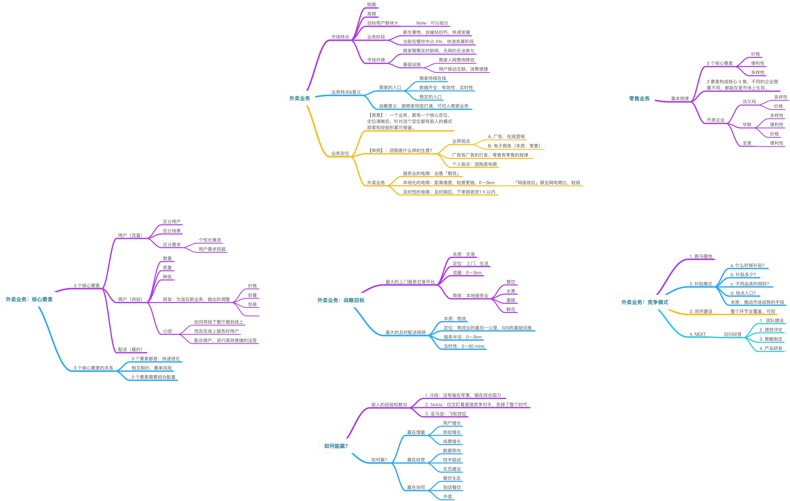

每种业务都有自己的商业模式，以及爆发时机，充分学习和分析业务，提升自己的视野，提升自己对行业的敏感度，提升自己的价值，为了改善生活而奋斗。

整体上，从几个方面进行分析：

外卖业务，一般性分析：

1. 目标用户
2. 市场潜力
3. 业务价值
4. 自身优势/劣势

外卖业务的特点和定位：

1. 业务特点：跟其他业务的差异
2. 业务定位：属于哪个大类？广告、零售？属于哪个大类，就要遵循这一大类的客观商业规律

外卖业务的核心点、关键要素：

1. 主体的划分：关键要素就是主体
2. 主体之间的关系：相互促进、相互约束？
3. 主体的稳定性
4. 如何健壮各个主体？建立稳健的业务，建立牢固的竞争壁垒

外卖业务，战略目标（清晰的竞争壁垒）：

1. 业务的实现过程中，完成商业模式上的构建
2. 核心的商业模式，一般只有 1～2 个，避免过度扩散

外卖业务，竞争模式：

1. 不同时间阶段，采用不同的竞争模式
2. 每个阶段，都有核心的竞争指标，如果有多个竞争指标，精简到一个

下一阶段，竞争战略，如何才能赢？有哪些核心战略？整体方向上？

1. 业内的经验和教训
2. 关注哪些战略方向和战略定位？

整体业务的分析：

[NingG]:    http://ningg.github.com  "NingG"

